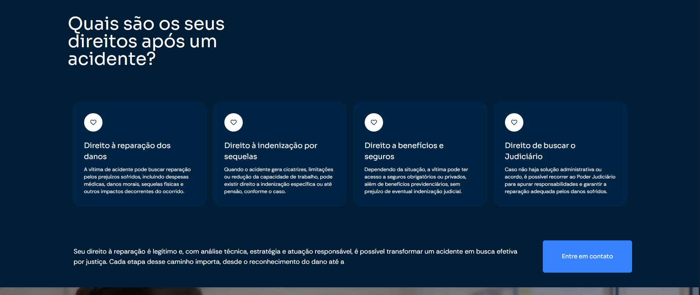
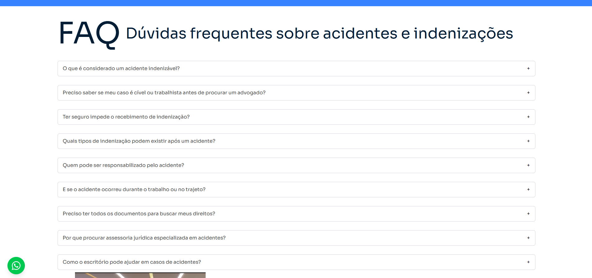

# 🚑 Landing Page: Indenizações por Acidentes

Este repositório apresenta uma Landing Page (LP) especializada desenvolvida para o escritório **Guedes Bampi Advogados**. O projeto foi projetado para converter leads que sofreram acidentes (trabalho, trânsito ou consumo), focando em uma jornada de usuário rápida e empática que facilita a solicitação de análise jurídica.

**🔗 Link em Produção:** [acidentes.guedesbampi.com.br](https://acidentes.guedesbampi.com.br/)

---

## 🏗️ Arquitetura e Infraestrutura

O projeto utiliza uma stack moderna focada em Web Vitals e controle total do ambiente de hospedagem:

1.  **Hospedagem em Hostinger VPS:** Deploy em servidor virtual privado configurado para alta disponibilidade e baixa latência.
2.  **Nginx as Reverse Proxy:** Gestão de requisições e terminação SSL, garantindo uma conexão segura (HTTPS) para o envio de dados sensíveis.
3.  **Next.js Optimized:** Renderização veloz que garante que a página esteja pronta para interação em milissegundos, crucial para tráfego vindo de anúncios (Ads).

---

## 🚀 Funcionalidades Técnicas em Destaque

### 📱 UX e Conversão
* **Interface Empática:** Design limpo e profissional que transmite acolhimento e autoridade no setor de acidentes e indenizações.
* **CTAs de Resposta Rápida:** Botões flutuantes de WhatsApp e formulários de contato estrategicamente posicionados para reduzir o atrito na conversão.
* **Mobile-First Real:** Otimização rigorosa para dispositivos móveis, plataforma onde ocorre a maioria dos acessos para este tipo de serviço jurídico.

### ⚙️ Engenharia de Software
* **Tailwind CSS:** Estilização modular que permite uma identidade visual coesa com os demais projetos do ecossistema Guedes Bampi.
* **Lógica de Formulário:** Validação de campos em tempo real para garantir que os dados do lead cheguem qualificados para a equipe jurídica.
* **SEO Técnico:** Estrutura de tags e metadados otimizada para palavras-chave de alta intenção no nicho de acidentes.

---

## 📸 Evidências Técnicas (Showcase)

### 🖥️ Hero Section (Impacto e Confiança)

  

### ⚖️ Especialidades e Detalhes do Direito

  
  

### 📩 Fluxo de Captação de Leads

  

### 📩 Full View

  

---

## 🛠️ Stack Tecnológica

| Camada | Tecnologias |
| :--- | :--- |
| **Framework** | Next.js |
| **Estilização** | Tailwind CSS |
| **Linguagem** | TypeScript |
| **Infraestrutura** | Hostinger VPS (Linux), Nginx, SSL |

---

> **Nota de Engenharia:** A implementação em Hostinger VPS demonstra a capacidade de gerenciar diferentes ambientes de produção, mantendo o padrão de segurança e performance exigido por clientes do setor jurídico.

---
## 👤 Autor
**Tiago R